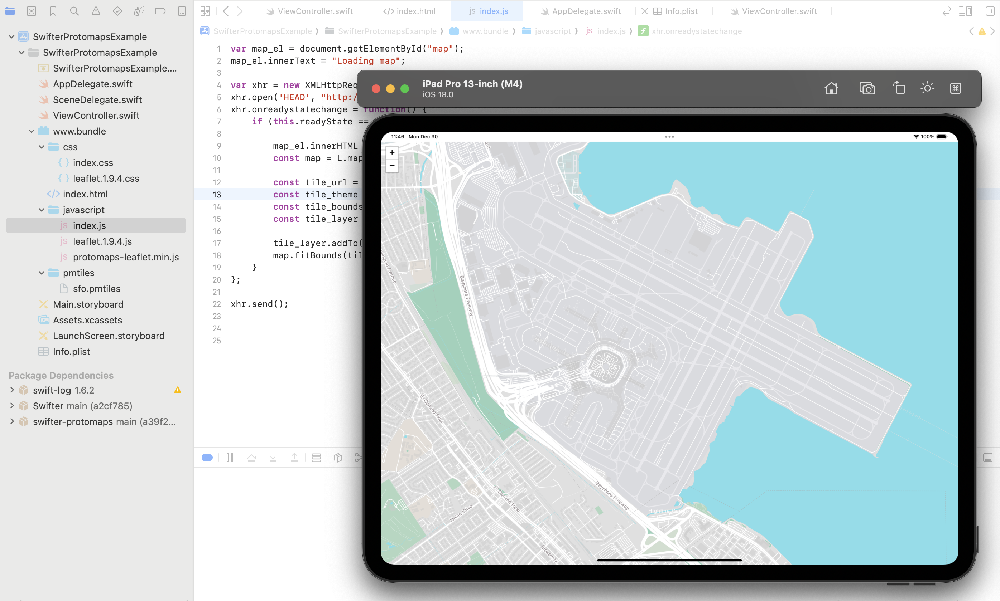
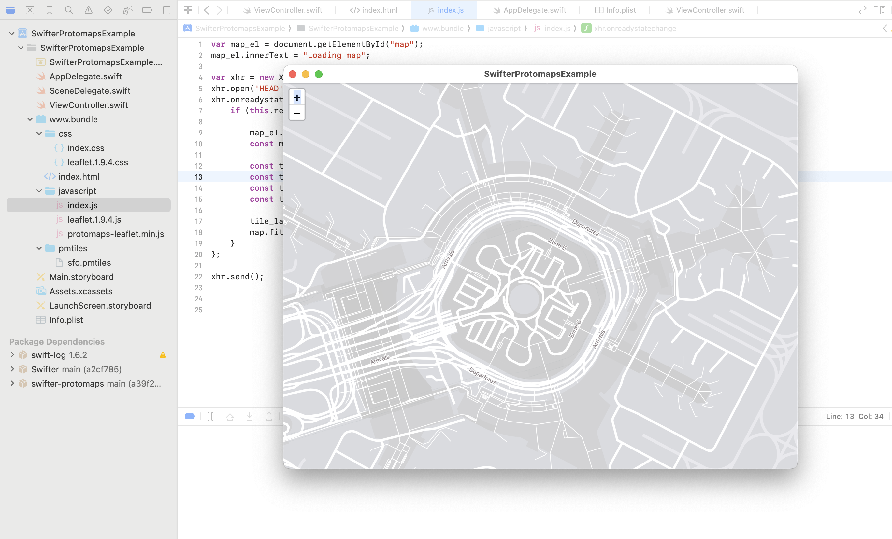

# swifter-protomaps-example

This is a simple iOS (and Mac Catalyst) application to demonstrate use of the [sfomuseum/swifter-protomaps](https://github.com/sfomuseum/swifter-protomaps) package.

It bundles a [Protomaps](https://github.com/protomaps/) tile database for the San Francisco International Airport (SFO, launches an instance of the [httpswifter/swifter](https://github.com/httpswift/swifter) HTTP server running on `localhost:9001` that will serve requests for those tiles and displays a single ViewController that loads a web application for displaying the tiles.

For a longer version detailing why we did this please see the [Serving map tiles to yourself using Protomaps and iOS](https://millsfield.sfomuseum.org/blog/2022/03/30/swifter-protomaps/) blog post.

## How does it work?

The [httpswifter/swifter](https://github.com/httpswift/swifter) HTTP server, and handlers for serving Protomaps tiles, is started in the applications `AppDelegate` code.

The web application is instantiated in the application's main `ViewController` code.

The web application itself is contain in the application's `www.bundle` package and makes requests for tiles to the local HTTP server.

## See also

* https://github.com/sfomuseum/swifter-protomaps
* https://github.com/httpswift/swifter
* https://github.com/protomaps/
